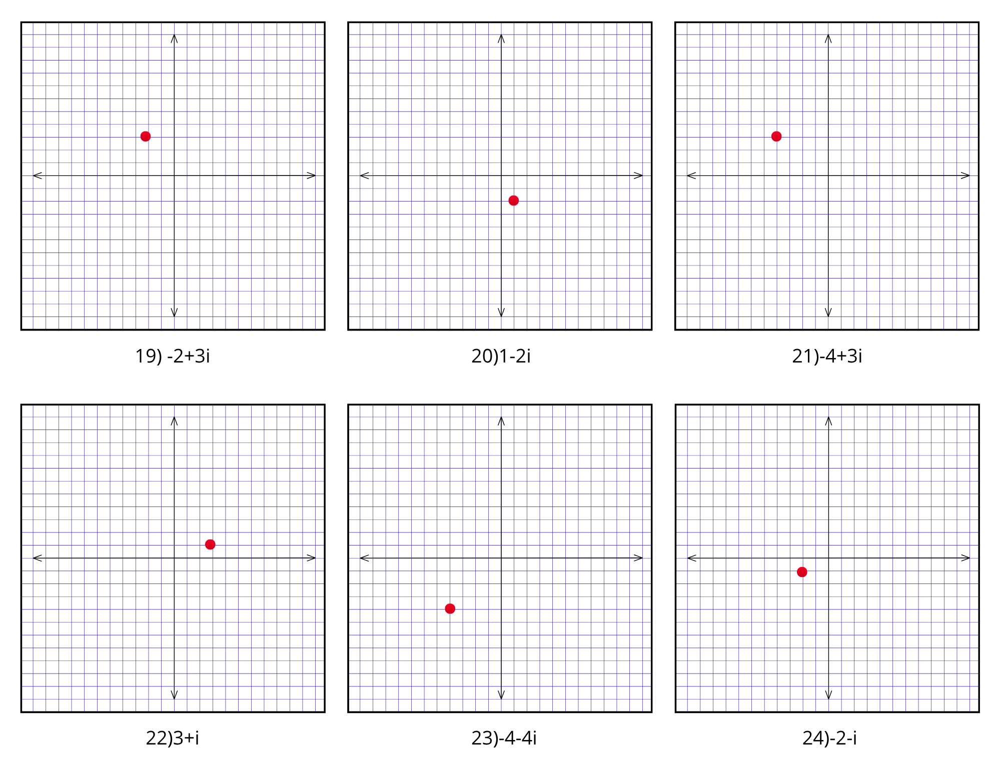

# FUNDAMENTOS-DE-ALGEBRA-JOSUE-PEREZ
## Graficación en el plano complejo

### Ejercicio 19
**Expresión:** $-2 + 3i$  
* **Procedimiento:** Eje Real $a = -2$ (izquierda), Eje Imaginario $b = 3$ (arriba). **Ubicación:** Cuadrante II.  
* **Respuesta:** Coordenada $(-2, 3)$

---

### Ejercicio 20
**Expresión:** $1 - 2i$  
* **Procedimiento:** Eje Real $a = 1$ (derecha), Eje Imaginario $b = -2$ (abajo). **Ubicación:** Cuadrante IV.  
* **Respuesta:** Coordenada $(1, -2)$

---

### Ejercicio 21
**Expresión:** $-4 + 3i$  
* **Procedimiento:** Eje Real $a = -4$ (izquierda), Eje Imaginario $b = 3$ (arriba). **Ubicación:** Cuadrante II.  
* **Respuesta:** Coordenada $(-4, 3)$

---

### Ejercicio 22
**Expresión:** $3 + i$  
* **Procedimiento:** Eje Real $a = 3$ (derecha), Eje Imaginario $b = 1$ (arriba). **Ubicación:** Cuadrante I.  
* **Respuesta:** Coordenada $(3, 1)$

---

### Ejercicio 23
**Expresión:** $-4 - 4i$  
* **Procedimiento:** Eje Real $a = -4$ (izquierda), Eje Imaginario $b = -4$ (abajo). **Ubicación:** Cuadrante III.  
* **Respuesta:** Coordenada $(-4, -4)$

---

### Ejercicio 24
**Expresión:** $-2 - i$  
* **Procedimiento:** Eje Real $a = -2$ (izquierda), Eje Imaginario $b = -1$ (abajo). **Ubicación:** Cuadrante III.  
* **Respuesta:** Coordenada $(-2, -1)$

---

## Operaciones básicas con complejos

### Ejercicio 25
**Expresión:** $(-3 + 2i) + (-6 - 7i)$  
* **Procedimiento:** $(-3 - 6) + (2 - 7)i$  
* **Respuesta:** $-9 - 5i$

---

### Ejercicio 26
**Expresión:** $(1 - 3i) - (4 - 2i)$  
* **Procedimiento:** $(1 - 4) + (-3 - (-2))i = -3 + (-3 + 2)i$  
* **Respuesta:** $-3 - i$

---

### Ejercicio 27
**Expresión:** $(-5 - 8i) - (-5 + 3i)$  
* **Procedimiento:** $(-5 - (-5)) + (-8 - 3)i = 0 - 11i$  
* **Respuesta:** $-11i$

---

### Ejercicio 28
**Expresión:** $(-2 - 4i) + (-2 + 4i)$  
* **Procedimiento:** $(-2 - 2) + (-4 + 4)i = -4 + 0i$  
* **Respuesta:** $-4$

---

### Ejercicio 29
**Expresión:** $(-3 + 4i) - (4 - 9i)$  
* **Procedimiento:** $(-3 - 4) + (4 - (-9))i = -7 + (4 + 9)i$  
* **Respuesta:** $-7 + 13i$

---

### Ejercicio 30
**Expresión:** $(-2 - 8i) - (-6 - 6i)$  
* **Procedimiento:** $(-2 - (-6)) + (-8 - (-6))i = (-2 + 6) + (-8 + 6)i$  
* **Respuesta:** $4 - 2i$

---

### Ejercicio 31
**Expresión:** $(2 + 2i)(2 - 2i)$  
* **Procedimiento:** $2^2 - (2i)^2 = 4 - 4(-1) = 4 + 4$  
* **Respuesta:** $8$

---

### Ejercicio 32
**Expresión:** $(6 + 2i)(-6 + 2i)$  
* **Procedimiento:** $(2i + 6)(2i - 6) = (2i)^2 - 6^2 = -4 - 36$  
* **Respuesta:** $-40$

---

### Ejercicio 33
**Expresión:** $(-28 + 14i)(17 + 23i)$  
* **Procedimiento:** $(-28)(17) + (-28)(23i) + (14i)(17) + (14i)(23i) = -476 - 644i + 238i - 322$  
* **Respuesta:** $-798 - 406i$

---

### Ejercicio 34
**Expresión:** $(12 - 10i)(-11 + 12i)$  
* **Procedimiento:** $(12)(-11) + (12)(12i) + (-10i)(-11) + (-10i)(12i) = -132 + 144i + 110i + 120$  
* **Respuesta:** $-12 + 254i$

---

### Ejercicio 35
**Expresión:** $(9 + 3i)(12 + 2i)$  
* **Procedimiento:** $(9)(12) + (9)(2i) + (3i)(12) + (3i)(2i) = 108 + 18i + 36i - 6$  
* **Respuesta:** $102 + 54i$

---

### Ejercicio 36
**Expresión:** $(-8 + 4i)(-12 - 9i)$  
* **Procedimiento:** $(-8)(-12) + (-8)(-9i) + (4i)(-12) + (4i)(-9i) = 96 + 72i - 48i + 36$  
* **Respuesta:** $132 + 24i$

---

### Ejercicio 37
**Expresión:** $\frac{-3 - 4i}{2 + i}$  
* **Procedimiento:** $\frac{(-3 - 4i)(2 - i)}{(2 + i)(2 - i)} = \frac{-6 + 3i - 8i - 4}{2^2 + 1^2} = \frac{-10 - 5i}{5}$  
* **Respuesta:** $-2 - i$

---

### Ejercicio 38
**Expresión:** $\frac{1 - 2i}{3 + 4i}$  
* **Procedimiento:** $\frac{(1 - 2i)(3 - 4i)}{(3 + 4i)(3 - 4i)} = \frac{3 - 4i - 6i - 8}{3^2 + 4^2} = \frac{-5 - 10i}{25}$  
* **Respuesta:** $-\frac{1}{5} - \frac{2}{5}i$ (o $-0.2 - 0.4i$)

---

### Ejercicio 39
**Expresión:** $\frac{2 + i}{1 - 3i}$  
* **Procedimiento:** $\frac{(2 + i)(1 + 3i)}{(1 - 3i)(1 + 3i)} = \frac{2 + 6i + i - 3}{1^2 + 3^2} = \frac{-1 + 7i}{10}$  
* **Respuesta:** $-\frac{1}{10} + \frac{7}{10}i$ (o $-0.1 + 0.7i$)

---

### Ejercicio 40
**Expresión:** $\frac{5i}{1 - 2i}$  
* **Procedimiento:** $\frac{5i(1 + 2i)}{(1 - 2i)(1 + 2i)} = \frac{5i - 10}{1^2 + 2^2} = \frac{-10 + 5i}{5}$  
* **Respuesta:** $-2 + i$

---

### Ejercicio 41
**Expresión:** $\frac{3 - i}{1 + 2i}$  
* **Procedimiento:** $\frac{(3 - i)(1 - 2i)}{(1 + 2i)(1 - 2i)} = \frac{3 - 6i - i - 2}{1^2 + 2^2} = \frac{1 - 7i}{5}$  
* **Respuesta:** $\frac{1}{5} - \frac{7}{5}i$ (o $0.2 - 1.4i$)

---

### Ejercicio 42
**Expresión:** $\frac{1 + 2i}{3 - 4i}$  
* **Procedimiento:** $\frac{(1 + 2i)(3 + 4i)}{(3 - 4i)(3 + 4i)} = \frac{3 + 4i + 6i - 8}{3^2 + 4^2} = \frac{-5 + 10i}{25}$  
* **Respuesta:** $-\frac{1}{5} + \frac{2}{5}i$ (o $-0.2 + 0.4i$)

---

## Valor absoluto / Módulo

### Ejercicio 43
**Expresión:** $\vert{}-9 - 9i\vert{}$  
* **Procedimiento:** $\sqrt{(-9)^2 + (-9)^2} = \sqrt{81 + 81} = \sqrt{162} = 9\sqrt{2}$  
* **Respuesta:** $9\sqrt{2} \approx 12.73$

---

### Ejercicio 44
**Expresión:** $\vert{}8 - 6i\vert{}$  
* **Procedimiento:** $\sqrt{8^2 + (-6)^2} = \sqrt{64 + 36} = \sqrt{100}$  
* **Respuesta:** $10$

---

### Ejercicio 45
**Expresión:** $\vert{}6 - 3i\vert{}$  
* **Procedimiento:** $\sqrt{6^2 + (-3)^2} = \sqrt{36 + 9} = \sqrt{45} = 3\sqrt{5}$  
* **Respuesta:** $3\sqrt{5} \approx 6.71$

---

### Ejercicio 46
**Expresión:** $\vert{}10 + 10i\vert{}$  
* **Procedimiento:** $\sqrt{10^2 + 10^2} = \sqrt{100 + 100} = \sqrt{200} = 10\sqrt{2}$  
* **Respuesta:** $10\sqrt{2} \approx 14.14$

---

### Ejercicio 47
**Expresión:** $\vert{}6 - 10i\vert{}$  
* **Procedimiento:** $\sqrt{6^2 + (-10)^2} = \sqrt{36 + 100} = \sqrt{136} = 2\sqrt{34}$  
* **Respuesta:** $2\sqrt{34} \approx 11.66$

---

### Ejercicio 48
**Expresión:** $\vert{}-1 + 7i\vert{}$  
* **Procedimiento:** $\sqrt{(-1)^2 + 7^2} = \sqrt{1 + 49} = \sqrt{50} = 5\sqrt{2}$  
* **Respuesta:** $5\sqrt{2} \approx 7.07$

---

## Potencias de $i$

### Ejercicio 49
**Expresión:** $i^5$  
* **Procedimiento:** $5 \div 4 = 1$ con residuo $1 \Rightarrow i^1$  
* **Respuesta:** $i$

---

### Ejercicio 50
**Expresión:** $i^{10}$  
* **Procedimiento:** $10 \div 4 = 2$ con residuo $2 \Rightarrow i^2$  
* **Respuesta:** $-1$

---

### Ejercicio 51
**Expresión:** $i^{20}$  
* **Procedimiento:** $20 \div 4 = 5$ con residuo $0 \Rightarrow i^0$  
* **Respuesta:** $1$

---

### Ejercicio 52
**Expresión:** $i^{35}$  
* **Procedimiento:** $35 \div 4 = 8$ con residuo $3 \Rightarrow i^3$  
* **Respuesta:** $-i$

---

### Ejercicio 53
**Expresión:** $i^{256}$  
* **Procedimiento:** $256 \div 4 = 64$ con residuo $0 \Rightarrow i^0$  
* **Respuesta:** $1$

---

### Ejercicio 54
**Expresión:** $i^{51}$  
* **Procedimiento:** $51 \div 4 = 12$ con residuo $3 \Rightarrow i^3$  
* **Respuesta:** $-i$

---

## Conversión a Forma Polar

### Ejercicio 55
**Expresión:** $6 - 8i$  
* **Procedimiento:** $r = \sqrt{6^2 + (-8)^2} = 10$. Ángulo $\alpha = \arctan(8/6) = 53.13^\circ$. Cuadrante IV: $\theta = 360^\circ - 53.13^\circ = 306.87^\circ$.  
* **Respuesta:** $10(\cos 306.87^\circ + i\sen 306.87^\circ)$

---

### Ejercicio 56
**Expresión:** $5\sqrt{2} + 5\sqrt{2}i$  
* **Procedimiento:** $r = \sqrt{(5\sqrt{2})^2 + (5\sqrt{2})^2} = 10$. Ángulo $\alpha = \arctan(1) = 45^\circ$. Cuadrante I: $\theta = 45^\circ$.  
* **Respuesta:** $10(\cos 45^\circ + i\sen 45^\circ)$

---

### Ejercicio 57
**Expresión:** $2 - 2\sqrt{3}i$  
* **Procedimiento:** $r = \sqrt{2^2 + (-2\sqrt{3})^2} = 4$. Ángulo $\alpha = \arctan(\sqrt{3}) = 60^\circ$. Cuadrante IV: $\theta = 360^\circ - 60^\circ = 300^\circ$.  
* **Respuesta:** $4(\cos 300^\circ + i\sen 300^\circ)$

---

### Ejercicio 58
**Expresión:** $\frac{3\sqrt{3}}{2} - \frac{3}{2}i$  
* **Procedimiento:** $r = \sqrt{(\frac{3\sqrt{3}}{2})^2 + (-\frac{3}{2})^2} = 3$. Ángulo $\alpha = \arctan(\frac{1}{\sqrt{3}}) = 30^\circ$. Cuadrante IV: $\theta = 360^\circ - 30^\circ = 330^\circ$.  
* **Respuesta:** $3(\cos 330^\circ + i\sen 330^\circ)$

---

### Ejercicio 59
**Expresión:** $-2$  
* **Procedimiento:** $r = \sqrt{(-2)^2 + 0^2} = 2$. Ubicado sobre el eje real negativo: $\theta = 180^\circ$.  
* **Respuesta:** $2(\cos 180^\circ + i\sen 180^\circ)$

---

### Ejercicio 60
**Expresión:** $-7i$  
* **Procedimiento:** $r = \sqrt{0^2 + (-7)^2} = 7$. Ubicado sobre el eje imaginario negativo: $\theta = 270^\circ$.  
* **Respuesta:** $7(\cos 270^\circ + i\sen 270^\circ)$

---

## Conversión a Forma Rectangular

### Ejercicio 61
**Expresión:** $\cos 30^\circ + i\sen 30^\circ$  
* **Procedimiento:** $a = 1 \cdot \cos(30^\circ) = \frac{\sqrt{3}}{2}$, $b = 1 \cdot \sen(30^\circ) = \frac{1}{2}$  
* **Respuesta:** $\frac{\sqrt{3}}{2} + \frac{1}{2}i$

---

### Ejercicio 62
**Expresión:** $2(\cos 60^\circ + i\sen 60^\circ)$  
* **Procedimiento:** $a = 2 \cdot \cos(60^\circ) = 1$, $b = 2 \cdot \sen(60^\circ) = \sqrt{3}$  
* **Respuesta:** $1 + \sqrt{3}i$

---

### Ejercicio 63
**Expresión:** $1.5(\cos 90^\circ + i\sen 90^\circ)$  
* **Procedimiento:** $a = 1.5 \cdot \cos(90^\circ) = 0$, $b = 1.5 \cdot \sen(90^\circ) = 1.5$  
* **Respuesta:** $1.5i$

---

### Ejercicio 64
**Expresión:** $2.5(\cos 120^\circ + i\sen 120^\circ)$  
* **Procedimiento:** $a = 2.5 \cdot \cos(120^\circ) = -1.25$, $b = 2.5 \cdot \sen(120^\circ) = \frac{2.5\sqrt{3}}{2}$  
* **Respuesta:** $-1.25 + 2.165i$

---

### Ejercicio 65
**Expresión:** $4(\cos 135^\circ + i\sen 135^\circ)$  
* **Procedimiento:** $a = 4 \cdot \cos(135^\circ) = -2\sqrt{2}$, $b = 4 \cdot \sen(135^\circ) = 2\sqrt{2}$  
* **Respuesta:** $-2\sqrt{2} + 2\sqrt{2}i$

---

### Ejercicio 66
**Expresión:** $3(\cos 180^\circ + i\sen 180^\circ)$  
* **Procedimiento:** $a = 3 \cdot \cos(180^\circ) = -3$, $b = 3 \cdot \sen(180^\circ) = 0$  
* **Respuesta:** $-3$

---

## Raíces de números complejos

### Ejercicio 67
**Expresión:** Las 2 raíces cuadradas de $4(\cos 30^\circ + i\sen 30^\circ)$  
* **Procedimiento:** $R = \sqrt{4} = 2$. Paso angular $= 360^\circ / 2 = 180^\circ$. Ángulo $0 = 30^\circ / 2 = 15^\circ$. Ángulo $1 = 15^\circ + 180^\circ = 195^\circ$.  
* **Respuesta:** $w_0 = 2(\cos 15^\circ + i\sen 15^\circ)$, $w_1 = 2(\cos 195^\circ + i\sen 195^\circ)$

---

### Ejercicio 68
**Expresión:** Las 2 raíces cuadradas de $3(\cos 90^\circ + i\sen 90^\circ)$  
* **Procedimiento:** $R = \sqrt{3}$. Paso angular $= 360^\circ / 2 = 180^\circ$. Ángulo $0 = 90^\circ / 2 = 45^\circ$. Ángulo $1 = 45^\circ + 180^\circ = 225^\circ$.  
* **Respuesta:** $w_0 = \sqrt{3}(\cos 45^\circ + i\sen 45^\circ)$, $w_1 = \sqrt{3}(\cos 225^\circ + i\sen 225^\circ)$

---

### Ejercicio 69
**Expresión:** Las 3 raíces cúbicas de $-4\sqrt{2} + 4\sqrt{2}i$  
* **Procedimiento:** En polar $8(\cos 135^\circ + i\sen 135^\circ)$. $R = \sqrt[3]{8} = 2$. Paso angular $= 360^\circ / 3 = 120^\circ$. Ángulos: $45^\circ, 165^\circ, 285^\circ$.  
* **Respuesta:** $w_0 = 2(\cos 45^\circ + i\sen 45^\circ)$, $w_1 = 2(\cos 165^\circ + i\sen 165^\circ)$, $w_2 = 2(\cos 285^\circ + i\sen 285^\circ)$

---

### Ejercicio 70
**Expresión:** Las 3 raíces cúbicas de $-\frac{27}{8}$  
* **Procedimiento:** En polar $\frac{27}{8}(\cos 180^\circ + i\sen 180^\circ)$. $R = \sqrt[3]{27/8} = 1.5$. Paso angular $= 120^\circ$. Ángulos: $60^\circ, 180^\circ, 300^\circ$.  
* **Respuesta:** $w_0 = 1.5(\cos 60^\circ + i\sen 60^\circ)$, $w_1 = -1.5$, $w_2 = 1.5(\cos 300^\circ + i\sen 300^\circ)$

---

### Ejercicio 71
**Expresión:** Las 5 raíces quintas de $-32i$  
* **Procedimiento:** En polar $32(\cos 270^\circ + i\sen 270^\circ)$. $R = \sqrt[5]{32} = 2$. Paso angular $= 360^\circ / 5 = 72^\circ$. Ángulo inicial $= 270^\circ / 5 = 54^\circ$.  
* **Respuesta:** $w_k = 2(\cos\theta_k + i\sen\theta_k)$ con $\theta_k \in \{54^\circ, 126^\circ, 198^\circ, 270^\circ, 342^\circ\}$

---

### Ejercicio 72
**Expresión:** Las 6 raíces sextas de $729$  
* **Procedimiento:** En polar $729(\cos 0^\circ + i\sen 0^\circ)$. $R = \sqrt[6]{729} = 3$. Paso angular $= 360^\circ / 6 = 60^\circ$. Ángulo inicial $= 0^\circ / 6 = 0^\circ$.  
* **Respuesta:** $w_k = 3(\cos\theta_k + i\sen\theta_k)$ con $\theta_k \in \{0^\circ, 60^\circ, 120^\circ, 180^\circ, 240^\circ, 300^\circ\}$
